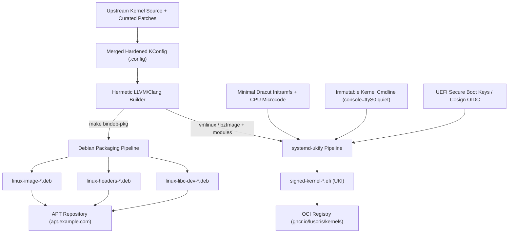

# Kernel Packaging & Delivery Architecture

> Authoritative engineering guide covering Debian `bindeb-pkg` compilation, systemd-ukify Unified Kernel Image (UKI) synthesis, initramfs contracts, and OCI distribution.

---

## 1. Overview & Dual Packaging Strategy

`lusoris-kernel-forge` delivers compiled kernels through two complementary delivery formats:

1. **Standard Debian Packages (`.deb`)**:
   - `linux-image-<version>-<stream>-<arch>.deb`: Contains the compressed kernel binary (`vmlinuz`), core drivers/modules (`/lib/modules/<version>`), and Device Tree Blobs (for ARM64/RISC-V).
   - `linux-headers-<version>-<stream>-<arch>.deb`: C headers and Makefiles required for out-of-tree DKMS modules (NVIDIA open kernel modules, OpenZFS 2.3).
   - `linux-libc-dev-<version>-<stream>-<arch>.deb`: Linux API user-space headers for glibc/musl compilation.
   - Designed for standard Debian/Ubuntu OS installations, container base hosts, and golden image provisioning in `lusoris-cloud-images`.

2. **Unified Kernel Images (UKI, `.efi`)**:
   - Single, signed, self-contained UEFI PE binary combining the Linux kernel (`.linux`), microcode + initramfs (`.initrd`), kernel command line (`.cmdline`), and OS release metadata (`.osrel`).
   - Designed for modern UEFI Secure Boot, TPM 2.0 measured boot, and direct network streaming (iPXE / systemd-boot).



---

## 2. Native Debian Packaging (`bindeb-pkg`)

The Linux kernel source tree features native Debian packaging targets (`deb-pkg` and `bindeb-pkg`). We utilize `bindeb-pkg` to avoid generating redundant source Debian tarballs (`.orig.tar.gz`), focusing strictly on binary artifacts.

### 2.1 Invocation & Environment Controls
Hermetic builds enforce reproducible timestamps and identity metadata:
```bash
make -C /usr/src/linux \
  O=/opt/lusoris/build/mainstream-x86_64 \
  ARCH=x86_64 \
  LLVM=1 \
  KDEB_PKGVERSION="7.2.4-lusoris1" \
  KBUILD_BUILD_TIMESTAMP="2026-09-10T00:00:00Z" \
  KBUILD_BUILD_USER="builder" \
  KBUILD_BUILD_HOST="kernel-forge.lusoris.org" \
  -j"$(nproc)" \
  bindeb-pkg
```

### 2.2 Localversion & Package Naming Contract
The kernel version string is constructed from upstream release plus a deterministic localversion:
- Upstream: `7.2.4`
- Localversion: `-lusoris1-mainstream-amd64`
- Resulting Kernel Release (`uname -r`): `7.2.4-lusoris1-mainstream-amd64`

This convention prevents collisions with distribution stock kernels (`linux-image-generic`, `linux-image-amd64`) and allows side-by-side installations in `/boot`.

### 2.3 Module Stripping & Debug Symbols
Production builds strip debug symbols from in-tree kernel modules before packaging, reducing `linux-image` size from >800MB to ~85MB:
- `CONFIG_DEBUG_INFO=n` or `CONFIG_DEBUG_INFO_DWARF5=y` with `CONFIG_DEBUG_INFO_SPLIT=y`.
- Module compression uses Zstandard (`CONFIG_MODULE_COMPRESS_ZSTD=y`), accelerating cold-boot module loading times by up to 45%.

---

## 3. Unified Kernel Images (UKI) via `systemd-ukify`

A Unified Kernel Image is an executable UEFI PE binary conforming to the [UAPI Group Boot Loader Specification (Type 2)](https://uapi-group.org/specifications/specs/boot_loader_specification/).

### 3.1 UKI Section Layout
Inside the synthesized `.efi` file, multiple sections are embedded:

| PE Section Name | Contents | Purpose |
| :--- | :--- | :--- |
| `.linux` | `bzImage` / `Image.gz` | The raw compressed Linux kernel executable |
| `.initrd` | CPIO archive (Dracut / Microcode) | Combined early CPU microcode + rootfs discovery initramfs |
| `.cmdline` | UTF-8 text string | Cryptographically pinned kernel parameters (e.g. `root=LABEL=cloudimg-rootfs ro console=ttyS0`) |
| `.osrel` | `/etc/os-release` | System identification for systemd-boot menu presentation |
| `.sbat` | SBAT metadata string | Secure Boot Advanced Targeting for revocation management |
| `.pcrpkey` | Public key PEM | Public key used for TPM 2.0 policy sealing |

### 3.2 Synthesis with `ukify`
`scripts/package-uki.sh` calls `ukify` to assemble and measure the image:
```bash
ukify build \
  --linux=/opt/lusoris/build/mainstream-x86_64/arch/x86/boot/bzImage \
  --initrd=/opt/lusoris/build/initramfs-mainstream-x86_64.img \
  --cmdline="console=tty1 console=ttyS0,115200 root=UUID=5f6a9e10-3b4c-4e8f-9a2d-1c3b5e7f9a12 ro quiet splash loglevel=3 mitigations=auto" \
  --os-release="@/etc/os-release" \
  --uname="7.2.4-lusoris1-mainstream-amd64" \
  --sbat="sbat,1,SBAT Version,sbat,1,https://github.com/systemd/systemd/blob/main/docs/SBAT.md\nlusoris,1,Lusoris Linux,lusoris,1,https://github.com/lusoris/lusoris-kernel-forge" \
  --secureboot-private-key="/etc/ssl/certs/db.key" \
  --secureboot-certificate="/etc/ssl/certs/db.crt" \
  --measure \
  --output="/opt/lusoris/output/mainstream-x86_64/BOOTX64.EFI"
```

### 3.3 TPM 2.0 PCR 11 Measurement & Sealing
When booting via `systemd-boot`, the UEFI boot loader measures the entire UKI payload directly into **TPM 2.0 PCR 11**:
- PCR 11 matches the cryptographic digest calculated during `ukify --measure`.
- Disk encryption keys (LUKS2 with `systemd-cryptenroll`) can be sealed to PCR 11: if the kernel, initramfs, or cmdline is altered by even a single bit, the TPM refuses to release the encryption key.

### 3.4 Automated Packaging CLI Drivers
Developers and automation pipelines utilize dedicated shell drivers complying with NASA/JPL Power of 10:

```bash
# Generate native Debian packages (.deb) with headers and libc-dev
./scripts/package-deb.sh --stream=mainstream --arch=x86_64 --dry-run
make package-deb STREAM=mainstream ARCH=x86_64

# Synthesize Unified Kernel Image (UKI) PE binary (.efi) with PCR 11 measurements
./scripts/package-uki.sh --stream=mainstream --arch=x86_64 --dry-run
make package-uki STREAM=mainstream ARCH=x86_64

# Verify byte-level build reproducibility across compilation passes
./scripts/verify-reproducibility.sh --dry-run
make verify-reproducibility
```

---

## 4. Initramfs Contracts & Driver Profiles

Initramfs creation is orchestrated via `dracut` using two distinct deployment profiles:

### 4.1 MicroVM / Cloud Instance Profile (`dracut-micro`)
For virtualization in Proxmox VE, KVM, and QEMU microVMs, boot latency must remain sub-second (< 350ms):
- **Omitted**: Bluetooth, sound, wireless, PCMCIA, legacy IDE, floppy, ISDN.
- **Included**: `virtio_pci`, `virtio_blk`, `virtio_net`, `virtio_scsi`, `virtio_console`, `nvme`, `overlay`, `ext4`, `xfs`.
- **Driver Model**: Core VirtIO storage and network drivers are built directly into the kernel (`=y`), allowing instantaneous pivot-root without waiting for module loading.

### 4.2 Bare-Metal & SAN Profile (`dracut-enterprise`)
For bare-metal physical hypervisors and storage appliances:
- **Included**: Intel i40e/ice, Mellanox ConnectX-5/6/7 (`mlx5_core`), Broadcom bnxt, Broadcom MegaRAID, NVMe-over-Fabrics (TCP/RDMA), OpenZFS root (`zfs`), and multipath.

---

## 5. Distribution & Downstream Delivery

### 5.1 Authenticated APT Repository
Compiled `.deb` packages are imported into an authenticated Debian archive powered by `reprepro`:
- **Repository URL**: `https://apt.example.com/kernels/`
- **Distributions**: `bookworm`, `trixie`, `noble`
- **Architectures**: `amd64`, `arm64`, `riscv64`
- **Signing**: InRelease files signed with project OpenPGP key.

```bash
# Example downstream consumption in Debian/Ubuntu:
curl -fsSL https://apt.example.com/kernels/archive-key.gpg | gpg --dearmor -o /etc/apt/trusted.gpg.d/lusoris-kernel.gpg
echo "deb [signed-by=/etc/apt/trusted.gpg.d/lusoris-kernel.gpg] https://apt.example.com/kernels/ noble main" > /etc/apt/sources.list.d/lusoris-kernel.list
apt-get update
apt-get install -y linux-image-7.2.4-lusoris1-mainstream-amd64 linux-headers-7.2.4-lusoris1-mainstream-amd64
```

### 5.2 OCI Registry Distribution (UKI Artifacts)
Signed `.efi` UKI binaries are pushed as OCI artifacts conforming to the OCI Artifact Specification:
```bash
# Packaging UKI as an OCI artifact using oras:
oras push ghcr.io/lusoris/kernels/mainstream-x86_64:7.2.4-lusoris1 \
  --artifact-type application/vnd.efi.uki \
  BOOTX64.EFI:application/octet-stream \
  SHA256SUMS:text/plain
```
Downstream bare-metal provisioning systems (`lusoris-cloud-images` iPXE streaming server or `systemd-sysupdate`) pull the OCI artifact and deploy it directly into the EFI System Partition (`/efi/EFI/Linux/`).

### 5.3 GitHub Release Assets & Downstream Artifact Manifest
`publish-release.yml` publishes one GitHub Release per stream tag with `*.deb`, `linux-<stream>-<version>-uki.efi`, `kernel-<stream>.config` (the merged kconfig written by `scripts/merge-config.sh`), `kernel-<stream>.cdx.json`, `kernel-<stream>.spdx.json`, `SHA256SUMS`, its keyless cosign bundle `SHA256SUMS.bundle`, and `kernel-<stream>.manifest.json`.

The manifest follows `imago.nucleus.kernel-artifact.v1`, a contract owned by the consumer `cordanaLLM/imago` (`pkg/kernel`). It is generated after `SHA256SUMS` is signed and is deliberately not listed in it:

```json
{
  "schema": "imago.nucleus.kernel-artifact.v1",
  "provider": "cordanaLLM/nucleus",
  "stream": "mainstream",
  "version": "7.2.4-lusoris1",
  "kernel": {"release": "7.2.4-lusoris1", "config_digest": "sha256:<digest of kernel-mainstream.config>"},
  "artifacts": [{"name": "linux-image-7.2.4-lusoris1_x86_64.deb", "sha256": "<64 hex>", "size": 123456}],
  "checksums": {"file": "SHA256SUMS", "sha256": "<64 hex>"},
  "provenance": {
    "repository": "cordanaLLM/nucleus",
    "tag": "v7.2.4-lusoris1",
    "revision": "<40 hex commit>",
    "bundle": "SHA256SUMS.bundle",
    "signer_identity": "https://github.com/cordanaLLM/nucleus/.github/workflows/publish-release.yml@refs/tags/v7.2.4-lusoris1"
  }
}
```

The downstream `repository_dispatch` payload (`kernel_release_published`) carries `stream`, `version`, and `tag`; imago downloads the release named by `tag`, verifies the cosign bundle over `SHA256SUMS`, recomputes the `SHA256SUMS` digest and every artifact digest and size against the manifest, and only then pins `kernel.streams.<stream>` (version, `artifact_digest`, provenance) in its `versions.json`.
